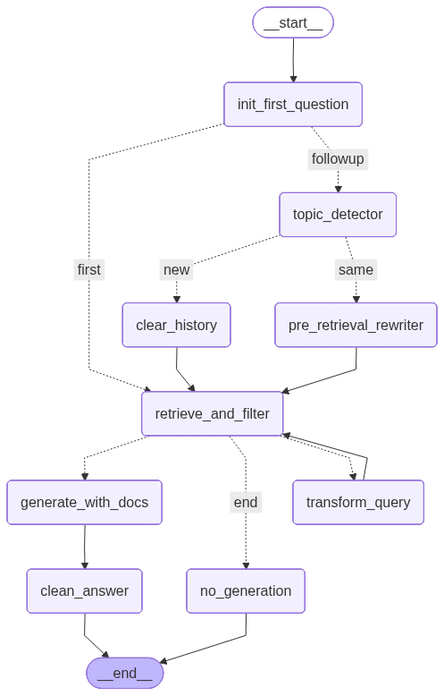

# RAG for PDF


##### Debugging

```bash
module load conda
salloc --job-name="rag" --nodes=1 --ntasks-per-node=1 --cpus-per-task=4 --gpus-per-node=1 --time=08:45:00 --nodelist=dgx01 --qos=mira
conda activate RAG
python -m debugpy --listen 0.0.0.0:5643 --wait-for-client rag_pdf_langchain.py
```

In another terminal

```bash
ssh -N -L 5643:dgx01:5643 dgx01
```





pip install fasttext
pip install langdetect

python3 -m pip install --upgrade pip setuptools wheel
python3 -m pip install sentencepiece
pip install sacremoses
pip install bitsandbytes
pip install mlx mlx-lm


We use faiss-cpu, but if we really want faiss gpu we can:
conda install -c pytorch -c nvidia faiss-gpu=1.8.0  # H100 compatible
